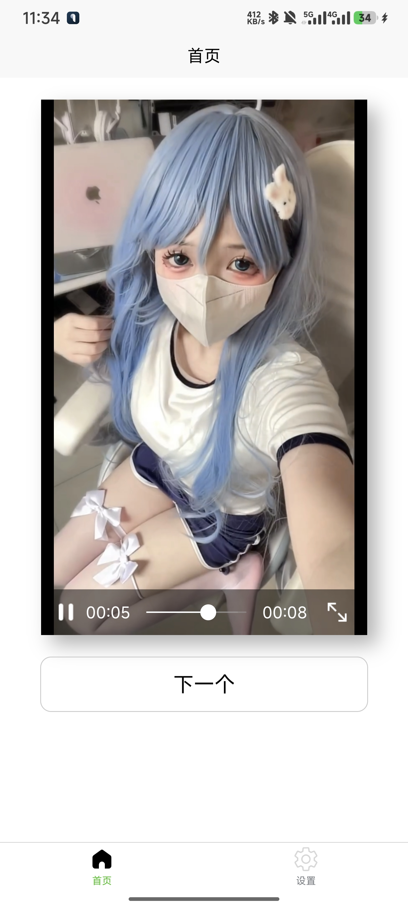
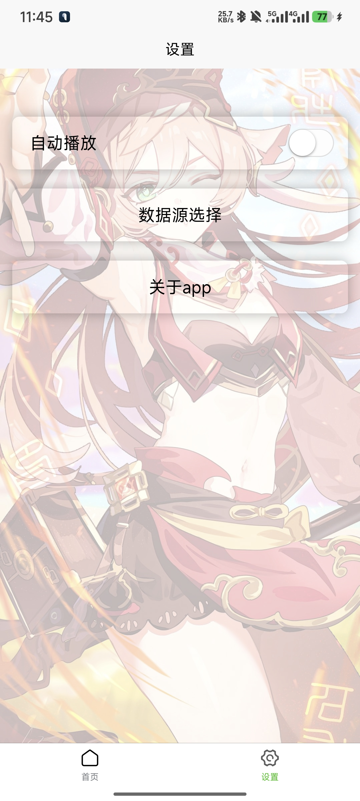

🎬 Girl Video App


## ✨ 项目简介

**Girl Video** 是一个精心设计的前端练手项目，基于 uni-app 框架开发的跨平台移动应用，专注于提供流畅的美女视频浏览体验。该项目展示了现代前端开发技术和响应式设计的应用。

## 🚀 特色功能

- 📱 **跨平台兼容** - 一套代码，多端运行（iOS、Android、H5）
- 🎞️ **智能视频播放** - 流畅的视频浏览和播放体验
- 🔍 **分类导航系统** - 便捷查找不同类型的内容
- ⚙️ **个性化设置** - 自定义您的使用体验

## 🛠️ 技术栈

<table>
  <tr>
    <td align="center"><br>Vue.js</td>
    <td align="center"><br>SCSS</td>
    <td align="center"><br>JavaScript</td>
    <td align="center"><br>uni-app</td>
  </tr>
</table>

- [**uni-app**](https://uniapp.dcloud.io/) - 跨平台前端应用框架
- **Vue.js** - 渐进式 JavaScript 框架
- **Sass/SCSS** - CSS预处理器
- [**uni-ui**](https://uniapp.dcloud.io/component/uniui/uni-ui.html) - uni-app生态的UI组件库

## 📂 项目结构

```
girl_video/
├── 📁 components/          # 自定义组件
│   ├── basic/              # 基础组件
│   └── basicnext/          # 扩展基础组件
├── 📁 pages/               # 页面文件
│   ├── index/              # 首页
│   ├── info/               # 信息页
│   └── setting/            # 设置页
├── 📁 static/              # 静态资源
│   ├── background.jpg      # 背景图
│   ├── card.jpg            # 卡片图
│   └── tabbar_ico/         # 底部导航栏图标
├── 📁 uni_modules/         # uni扩展组件
│   ├── uni-card/           # 卡片组件
│   ├── uni-data-checkbox/  # 数据驱动的单选复选框
│   ├── uni-drawer/         # 抽屉组件
│   ├── uni-icons/          # 图标组件
│   ├── uni-load-more/      # 加载更多组件
│   └── uni-scss/           # 全局样式库
├── 📄 App.vue              # 应用入口组件
├── 📄 main.js              # 应用入口文件
├── 📄 manifest.json        # 应用配置文件
├── 📄 pages.json           # 页面路由配置
├── 📄 uni.scss             # 全局样式变量
└── 📄 README.md            # 项目说明文档
```

## ⚙️ 安装和使用

### 环境要求

| 工具 | 版本 | 说明 |
|------|------|------|
| [HBuilderX](https://www.dcloud.io/hbuilderx.html) | 最新版 | 官方推荐IDE |
| Node.js | ≥ 12.0 | JavaScript运行环境 |

### 安装步骤

<details>
<summary>📥 <b>点击展开安装步骤</b></summary>

1. **克隆项目**
   ```bash
   git clone https://github.com/your-username/girl_video.git
   cd girl_video
   ```

2. **使用HBuilderX打开项目文件夹**

3. **安装依赖**
   ```bash
   npm install
   ```

4. **运行项目**
   - 在HBuilderX中点击"运行"到浏览器或模拟器
   - 或使用命令行：`npm run dev`
</details>

### 🏗️ 打包发布

使用HBuilderX的"发行"功能，可一键打包为:
- 📱 Android APK
- 📱 iOS IPA 
- 📱 各端小程序

## 🧩 组件使用

项目集成了丰富的uni-ui组件，为开发提供便利：

| 组件 | 用途 | 文档链接 |
|------|------|---------|
| uni-card | 卡片式布局 | [文档](https://uniapp.dcloud.io/component/uniui/uni-card) |
| uni-icons | 图标库 | [文档](https://uniapp.dcloud.io/component/uniui/uni-icons) |
| uni-drawer | 侧滑菜单 | [文档](https://uniapp.dcloud.io/component/uniui/uni-drawer) |
| uni-load-more | 加载更多 | [文档](https://uniapp.dcloud.io/component/uniui/uni-load-more) |
| uni-data-checkbox | 数据驱动选择框 | [文档](https://uniapp.dcloud.io/component/uniui/uni-data-checkbox) |

## 📱 应用截图

<div align="center">
  <table>
    <tr>
      <td align="center"><br>首页</td>
      <td align="center"><br>分类页</td>
    </tr>
  </table>
</div>

## 📚 学习资源

- [uni-app官方文档](https://uniapp.dcloud.io/component/)
- [Vue.js文档](https://cn.vuejs.org/)
- [uni-app项目实战视频教程](https://www.bilibili.com/video/BV1BJ411W7pX)

## 👨‍💻 贡献指南

欢迎提交PR或Issue来完善项目！详细贡献指南请参考 CONTRIBUTING.md。

## 👤 作者

<table>
  <tr>
    <td align="center">
        <sub><b>Lucky</b></sub>
    </td>
  </tr>
</table>

## 📝 许可证

MIT © Lucky

---

<p align="center">
  <i>🌟 如果这个项目对你有帮助，别忘了给它点赞！🌟</i><br>
  <i>注：此项目仅用于学习和练手，请合法使用相关素材和内容。</i>
</p>