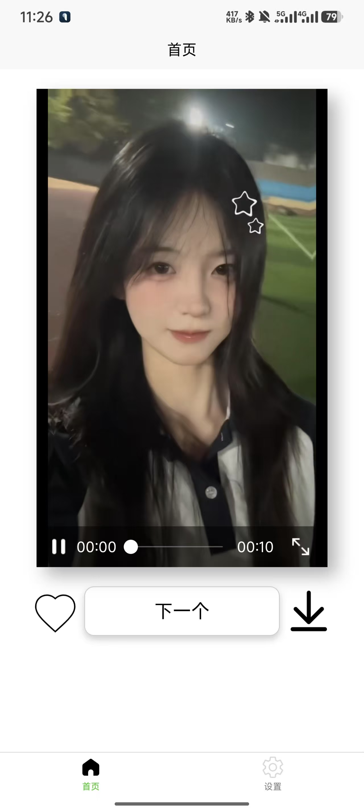
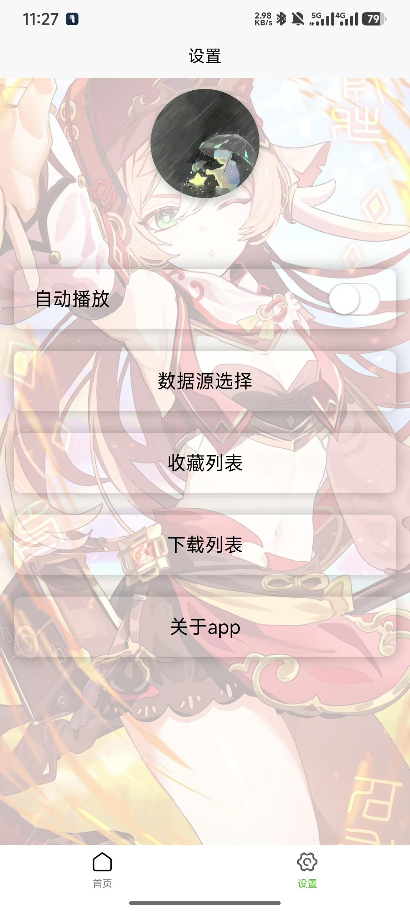

🎬 Girl Video App


<div align="center">
  
</div>

## ✨ 项目简介

**Girl Video** 是一个精心设计的前端练手项目，基于 uni-app 框架开发的跨平台移动应用，专注于提供流畅的美女视频浏览体验。该项目展示了现代前端开发技术和响应式设计的实践应用。

## 🚀 核心功能

| 功能 | 描述 |
|------|------|
| 📱 **跨平台兼容** | 一套代码，多端运行（iOS、Android、H5） |
| 🎞️ **智能视频播放** | 流畅的视频浏览和自动播放功能 |
| ❤️ **收藏系统** | 一键收藏喜欢的视频内容 |
| 💾 **下载管理** | 支持视频本地下载和管理 |
| 🔍 **分类导航** | 多种视频分类，便捷查找不同类型内容 |
| ⚙️ **个性化设置** | 自定义播放设置和应用主题 |
| 👤 **用户账户** | 支持账户登录和数据同步 |

## 🛠️ 技术栈

<table>
  <tr>
    <td align="center"><br>Vue 3</td>
    <td align="center"><br>SCSS</td>
    <td align="center"><br>JavaScript</td>
    <td align="center"><br>uni-app</td>
  </tr>
</table>

- **Vue 3 + Composition API** - 现代化的响应式框架
- **uni-app** - 跨平台前端应用框架
- **Pinia** - 下一代Vue状态管理库
- **Sass/SCSS** - CSS预处理器
- **uni-ui** - uni-app生态的UI组件库

## 📂 项目结构

```bash
girl_video/
├── 📁 components/          # 自定义组件
│   ├── basic/              # 基础视频播放组件
│   └── basicnext/          # 扩展组件
├── 📁 pages/               # 应用页面
│   ├── index/              # 首页
│   ├── list/               # 视频列表页
│   ├── info/               # 应用信息页
│   ├── setting/            # 设置页
│   └── downloadList/       # 下载管理页
├── 📁 static/              # 静态资源
├── 📁 store/               # 状态管理
├── 📁 uni_modules/         # uni-app扩展组件
├── 📄 App.vue              # 应用入口组件
├── 📄 main.js              # 应用入口文件
└── 📄 manifest.json        # 应用配置文件
```

## ⚙️ 安装和运行

### 环境要求

| 工具 | 版本 | 说明 |
|------|------|------|
| [HBuilderX](https://www.dcloud.io/hbuilderx.html) | 3.6.0+ | 推荐的开发IDE |
| Node.js | ≥ 14.0 | JavaScript运行环境 |
| npm/yarn | 最新版 | 包管理工具 |

### 快速开始

```bash
# 克隆项目
git clone https://github.com/your-username/girl_video.git

# 进入项目目录
cd girl_video

# 安装依赖
npm install
# 或使用yarn
yarn

# 运行开发服务器
# 方法1: 使用HBuilderX运行到浏览器/模拟器
# 方法2: 命令行运行
npm run dev:h5
```

### 构建与发布

```bash
# 打包H5版本
npm run build:h5

# 打包App
# 推荐使用HBuilderX的云打包功能
```

## 🧩 核心组件

项目中使用的主要组件及其功能:

| 组件名称 | 路径 | 功能描述 |
|---------|------|---------|
| basic | basic.vue | 核心视频播放组件，支持播放、收藏和下载 |
| setting | setting.vue | 用户设置和账户管理页面 |
| downloadList | downloadList.vue | 下载内容管理页面 |

## 📱 应用截图

<div align="center">
  <table>
    <tr>
      <td align="center"><br>首页视图</td>
      <td align="center"><br>分类浏览</td>
    </tr>
    <tr>
      <td align="center" colspan="2"><b>🔍 更多界面预览请安装体验</b></td>
    </tr>
  </table>
</div>

## 🔮 项目特点

- **响应式设计** - 完美适配各种屏幕尺寸
- **流畅动画** - 精心设计的过渡效果
- **离线功能** - 支持视频缓存和离线观看
- **性能优化** - 针对移动设备的性能优化
- **主题定制** - 支持浅色/深色主题切换

## 📚 开发资源

- [uni-app官方文档](https://uniapp.dcloud.io/component/)
- [Vue 3文档](https://cn.vuejs.org/)
- [uni-app项目实战视频教程](https://www.bilibili.com/video/BV1BJ411W7pX)
- [Composition API指南](https://v3.cn.vuejs.org/guide/composition-api-introduction.html)

## 🤝 参与贡献

1. Fork 此仓库
2. 创建你的特性分支 (`git checkout -b feature/amazing-feature`)
3. 提交你的改动 (`git commit -m 'Add some amazing feature'`)
4. 推送到分支 (`git push origin feature/amazing-feature`)
5. 开启一个 Pull Request

## 🐛 问题反馈

如果你发现任何问题或有改进建议，请[提交issue](https://github.com/your-username/girl_video/issues)或联系开发者。

## 👤 开发者

<table>
  <tr>
    <td align="center">
      <a href="https://github.com/luckylca">
        <br>
        <sub><b>Lucky</b></sub>
      </a>
    </td>
  </tr>
</table>

## 📝 许可证

MIT © Lucky

---

<p align="center">
  <i>🌟 如果这个项目对你有帮助，别忘了给它点赞！🌟</i><br>
  <i>注：此项目仅用于学习和练手，请合法使用相关素材和内容。</i>
</p>