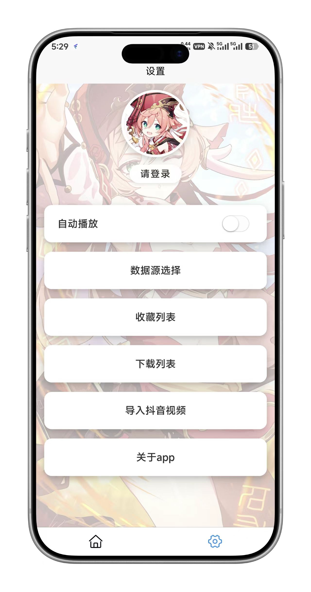

# 🎬 Girl Video


<div align="center">
  
</div>

<br>

## ✨ 项目简介

**Girl Video** 是一款基于 **uni-app** 框架打造的高性能跨平台短视频应用。项目采用 **Vue 3** + **Composition API** 现代开发范式，使用了NVUE和VUE混合的模式，主界面采用NVUE来完成，其他页面则是uniapp页面，结合 **Material Design** 美学设计，致力于提供丝滑流畅的沉浸式视频浏览体验。

本项目集成了抖音视频解析、滑动播放控制、个性化推荐等核心功能，是学习现代前端技术栈（Vue 3, Pinia, Vite）与移动端混合开发的绝佳实战案例。

后端开源链接https://github.com/luckylca/girl_video_backend，佬友轻喷😭😭😭

目前打算用RN重构，还在慢慢学习摸索中，这是RN的仓库https://github.com/luckylca/GirlVideo_ByReactNative，界面肯定会做好看的😭

## 🚀 核心功能

| 功能模块 | 详细说明 | 状态 |
|---------|---------|:---:|
| 🎥 **沉浸式播放** | 全屏竖屏滑动播放，场景使用 BindingX 优化动画，体验丝滑流畅 | ✅ |
| 🕷️ **多源解析** | **新增** 支持抖音 无水印视频爬取与解析播放 | ✅ |
| 🎨 **Material 设计** | 遵循 Material Design 规范，界面精致，交互自然 | ✅ |
| ⚡ **性能优化** | 使用 BindingX 优化手势交互，告别卡顿与动画突变 | ✅ |
| 💾 **资源管理** | 支持视频本地下载，支持视频收藏 | ✅ |
| � **频道管理** | 自定义视频频道切换，支持随机推荐 | ✅ |
| ❤️ **点赞收藏** | 完整的点赞动画交互与本地收藏夹功能 | ✅ |
| � **版本更新** | 内置应用内更新检测 | ✅ |

## 🛠️ 技术栈

本项目采用前沿的技术栈进行构建：

- **核心框架**: [Vue 3](https://v3.cn.vuejs.org/) (Composition API)
- **跨端框架**: [uni-app](https://uniapp.dcloud.io/) 和 NVUE 混合使用的模式
- **状态管理**: [Pinia](https://pinia.vuejs.org/) (取代 Vuex)
- **CSS 预处理**: SCSS
- **UI 组件库**: [uni-ui](https://uniapp.dcloud.io/component/uniui/uni-ui)
- **动画引擎**: BindingX (Android/iOS 高性能动画)
- **构建工具**: Vite

## 📂 项目结构

```bash
girl_video/
├── 📁 components/          # 公共组件
│   ├── basic/              # 核心播放器组件，目前暂时弃用
├── 📁 pages/               # 页面视图
│   ├── index/              # 首页 (沉浸式视频流)
│   ├── list/               # 频道列表
│   ├── info/               # 关于页
│   ├── setting/            # 设置与账号
│   ├── douyinSetting/      # 抖音视频爬取页面
│   └── downloadList/       # 下载管理
├── 📁 static/              # 静态资源 (图片/图标)
├── 📁 store/               # Pinia 状态管理模块
├── 📁 uni_modules/         # 插件模块 (UI库等)
├── 📄 App.vue              # 根组件
├── 📄 main.js              # 入口文件
└── 📄 manifest.json        # 跨端配置
```

## ⚙️ 安装与运行

### 环境准备

确保您的开发环境已安装以下工具：

1. **HBuilderX** (推荐 3.6.0+) - [下载地址](https://www.dcloud.io/hbuilderx.html)
2. **Node.js** (16.0+) - [下载地址](https://nodejs.org/)

### 快速启动

1. **克隆项目**
   ```bash
   git clone https://github.com/luckylca/girl_video.git
   ```

2. **导入项目**
   - 打开 HBuilderX
   - 选择 `文件` -> `导入` -> `从本地目录导入`，选择 `girl_video` 文件夹

3. **安装依赖**
   - uni插件市场上按需求下载插件导入

4. **运行调试**
   - **H5 端**: 顶部菜单 `运行` -> `运行到浏览器` -> `Chrome`
   - **App 端**: 连接手机，`运行` -> `运行到手机或模拟器` -> `标准基座运行`

## 🧩 关键组件说明

- **VideoPlayer (`index.nvue`)**:
  应用的核心心脏。封装了 `video` 原生组件，实现了手势滑动控制、双击点赞、进度条拖拽以及与 BindingX 的深度集成，保证了原生级的滑动体验。

- **Store (`pinia`)**:
  使用 Pinia 模块化管理 `user` (用户信息), `video` (播放列表), `draw` (频道列表) 等状态，数据流清晰可控。

## 📱 界面预览

<div align="center">
  <table>
    <tr>
      <td align="center"><br><b>沉浸视频流</b></td>
      <td align="center"><br><b>频道探索</b></td>
    </tr>
  </table>
  <p><i>� 左右滑动查看更多细节</i></p>
</div>

## 🤝 贡献指南

欢迎提交 Issue 和 PR！
1. Fork 本仓库
2. 新建分支 `feat/NewFeature`
3. 提交代码
4. 发起 Pull Request

## � 作者

**Lucky**
<br>
<a href="https://github.com/luckylca">Github @luckylca</a>

## 📝 开源协议


MIT License © 2024 Lucky
